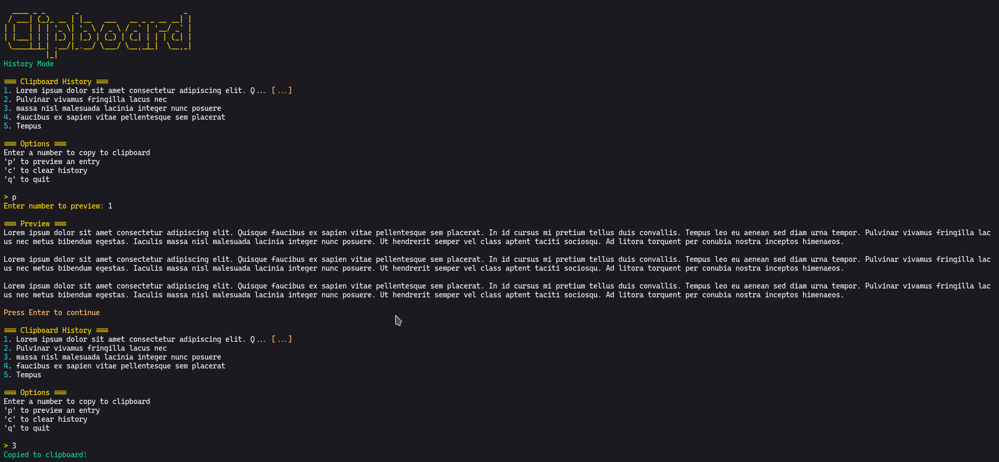
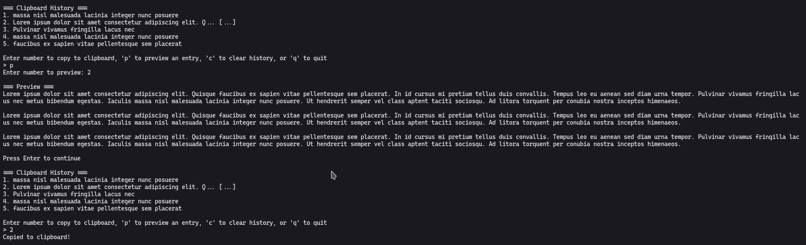

# Clipboard Manager

A Python-based clipboard manager that monitors and manages clipboard history with a clean terminal interface.
Written as a personal tool, to do a simple job for Linux systems.

There are two versions: 

colorful with Ascii art


plain and less distracting


Consider changing the commands in the following guide, if you should choose the plain version.

## Features

- Monitor clipboard changes in real-time
- Maintain clipboard history (up to 5 entries by default)
- Colorized terminal output
- System service integration
- Desktop application support

## Installation

### 1. Clone and Setup

```bash
git clone https://github.com/IominimoI/clipboard-manager.git
cd clipboard-manager
```

### 2. Make Script Executable

```bash
chmod +x clipboard-manager.py
```

### 3. Create Symbolic Link for Easy Access

Create a symbolic link in your PATH to use `cbm` command:

```bash
sudo ln -s $(pwd)/clipboard-manager.py /usr/local/bin/cbm
```

Now you can run the clipboard manager from anywhere using:

```bash
cbm
```

## System Service Setup

### 1. Install Service File

Copy the systemd service file to the user services directory:

```bash
mkdir -p ~/.config/systemd/user
cp clipboard-monitor.service ~/.config/systemd/user/
```

### 2. Update Service File Path

Edit the service file to use the correct path:

```bash
sed -i "s|/path/to/clipboard-manager.py|$(pwd)/clipboard-manager.py|g" ~/.config/systemd/user/clipboard-monitor.service
```

### 3. Enable and Start Service

```bash
# Reload systemd user daemon
systemctl --user daemon-reload

# Enable service to start on boot
systemctl --user enable clipboard-monitor.service

# Start the service now
systemctl --user start clipboard-monitor.service

# Check service status
systemctl --user status clipboard-monitor.service
```

## Desktop Application Setup

### 1. Install Desktop Entry

Copy the desktop file to applications directory:

```bash
mkdir -p ~/.local/share/applications
cp clipboard-monitor.desktop ~/.local/share/applications/
```

### 2. Update Desktop File Path

```bash
sed -i "s|/path/to/clipboard-manager.py|$(pwd)/clipboard-manager.py|g" ~/.local/share/applications/clipboard-monitor.desktop
```

### 3. Update Desktop Database

```bash
update-desktop-database ~/.local/share/applications/
```

## Dependencies

- Python 3.6+
- `xclip` (for clipboard access)

Install xclip:

```bash
# Ubuntu/Debian
sudo apt install xclip

# Arch Linux
sudo pacman -S xclip

# Fedora
sudo dnf install xclip
```

## Usage

### Command Line

```bash
# Run directly
./clipboard-manager.py

# Or use the symbolic link
cbm

# View help
cbm --help
```

### Service Management

```bash
# Start service
systemctl --user start clipboard-monitor.service

# Stop service
systemctl --user stop clipboard-monitor.service

# Restart service
systemctl --user restart clipboard-monitor.service

# View logs
journalctl --user -u clipboard-monitor.service -f
```

## Configuration

The clipboard manager stores its history in `~/.clipboard_history`. You can modify the following settings in the script:

- `max_entries`: Maximum number of clipboard entries to store (default: 5)
- `history_file`: Location of the history file

## File Structure

```
clipboard-manager/
├── clipboard-manager.py          # Main application with color and Ascii art.
├── clipboard-manager-plain.py    # Simplified, less distracting version
├── clipboard-monitor.service     # Systemd service file
├── clipboard-monitor.desktop     # Desktop application file
└── README.md                     # This file
```

## Troubleshooting

### Service Not Starting

Check service logs:
```bash
journalctl --user -u clipboard-monitor.service
```

### Clipboard Access Issues

Ensure xclip is installed and working:
```bash
echo "test" | xclip -selection clipboard
xclip -o -selection clipboard
```

### Permission Issues

Make sure the script is executable:
```bash
chmod +x clipboard-manager.py
```

## Uninstall

```bash
# Stop and disable service
systemctl --user stop clipboard-monitor.service
systemctl --user disable clipboard-monitor.service

# Remove files
rm ~/.config/systemd/user/clipboard-monitor.service
rm ~/.local/share/applications/clipboard-monitor.desktop
sudo rm /usr/local/bin/cbm

# Remove history file (optional)
rm ~/.clipboard_history

# Reload systemd and update desktop database
systemctl --user daemon-reload
update-desktop-database ~/.local/share/applications/
```

## License

This project is open source. Feel free to modify and distribute.

